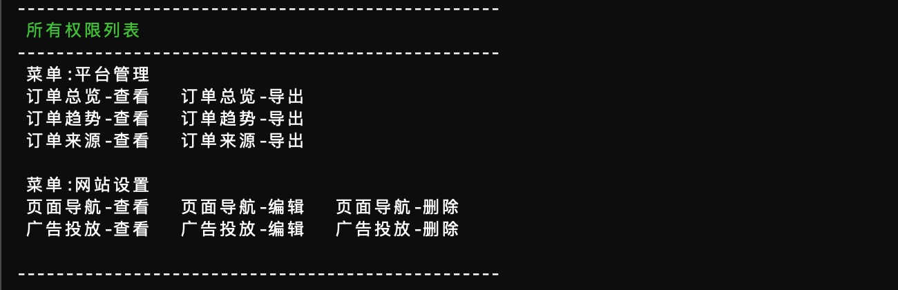
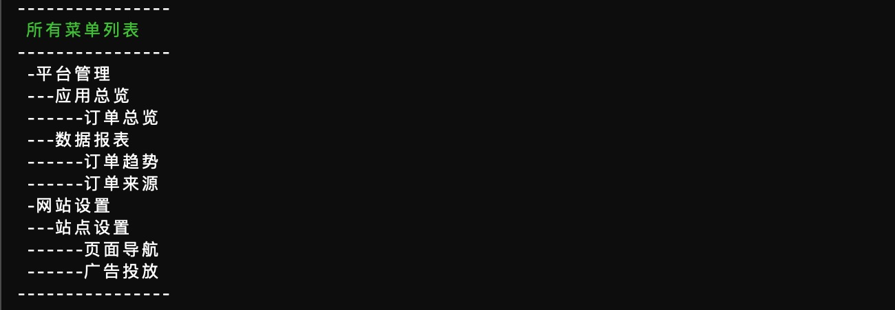
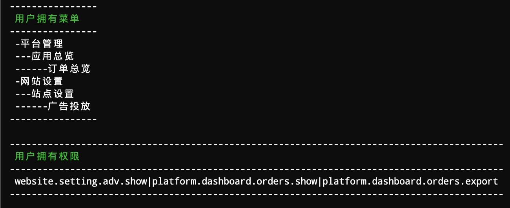

# simple-permission
Laravel 扩展包，让后端的菜单与权限控制如此轻松，基于角色的权限控制，简单所以高效

## Composer 安装

```shell
composer require helingfeng/simple-permission
```

```shell
php artisan vendor:publish
```

## 数据库迁移

```shell
php artisan migrate
php artisan db:seed --class=LaravelUsersSeeder

```

## 菜单结构 ？

菜单 `menu.php` 文件，定义了菜单与权限的基础信息。为了简单起见，菜单`固定`为`三层级`结构，
第一第二层级作为`模块声明`定义，第三层级做`有效链接`定义，详情可以直接浏览`menu.php` 文件。

| 字段| 描述 |
| ------ | ------ |
| slug | 作为菜单标识字符串，同层级下不允许重复出现 |
| icon | 图标 CSS CLASS 配置，例如 fa-dashboard |
| route | 跳转链接，具体根据系统情况定义，此参数第三层级才有效 |
| expect | 配置为1时，弃用默认权限（查看、编辑、删除） |
| permission |自定义权限，KEY-VALUE 组成，允许覆盖默认（查看、编辑、删除）权限 |

## 权限命令

- 获取当前数据库配置的所有菜单清单
```shell
php artisan command:menu
```


- 获取数据库配置的所有权限可选项
```shell
php artisan command:permission
```


- 输出当前看守者用户的拥有的权限与菜单
```shell
php artisan command:user
```


## 如何使用

- 路由中控制权限

对访问的路由进行权限配置，此处的权限标识与`menu.php`文件保持一致即可 
```markdown
Route::group(['middleware' => 'permission:platform.dashboard.orders.show'], function(Router $router){
    //... your router
});
```

- 页面模板中控制权限

自定义模板标签
```blade
@can('platform.dashboard.orders.export')
    // todo your code
@endcan
```